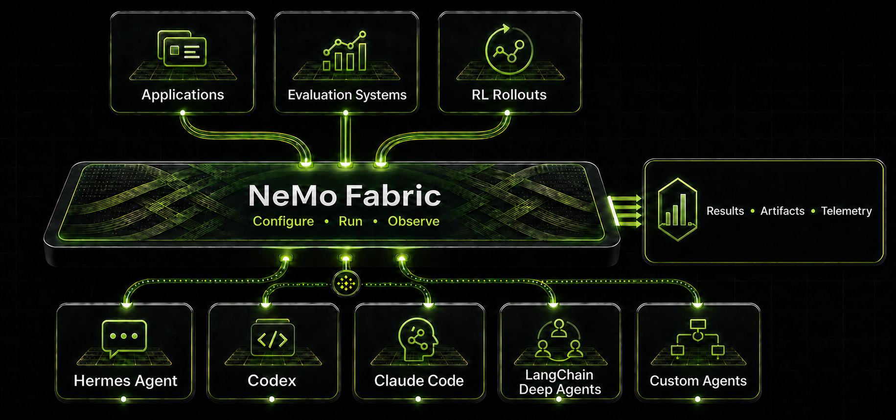
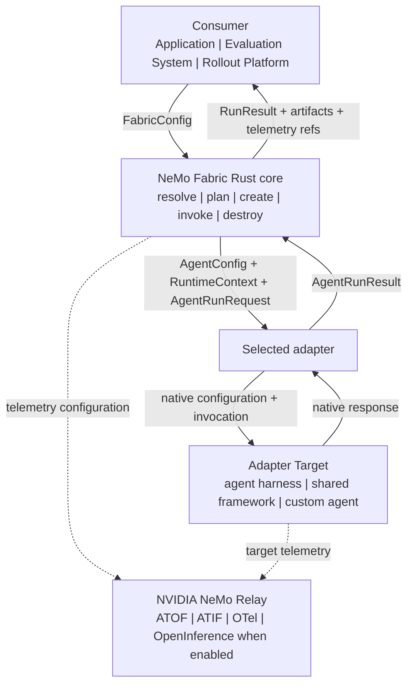

<!--
SPDX-FileCopyrightText: Copyright (c) 2026, NVIDIA CORPORATION & AFFILIATES. All rights reserved.
SPDX-License-Identifier: Apache-2.0
-->

# NVIDIA NeMo Fabric

[](https://github.com/NVIDIA/NeMo-Fabric/blob/main/LICENSE)
[](https://github.com/NVIDIA/NeMo-Fabric/)
[](https://github.com/NVIDIA/NeMo-Fabric/releases)
[](https://pypi.org/project/nemo-fabric/)
[](https://crates.io/crates/nemo-fabric-core)
[](https://crates.io/crates/nemo-fabric-cli)

<p align="center">
  
</p>

NeMo Fabric gives applications and platforms one configurable, observable way
to run agent harnesses and custom agents. It standardizes configuration,
lifecycle management, and run outputs—including results, artifacts, and
telemetry—so teams do not need to build a separate integration for every
harness or agent.

Any system that invokes an agent through NeMo Fabric is a **consumer**. An
**adapter** translates NeMo Fabric configuration and lifecycle operations into
the native execution model of an agent harness, framework, or custom agent.
That system is the **Adapter Target**.

**Consumers** use the Python SDK and typed `FabricConfig` to compose experiment
variants, plan and run targets, and receive normalized results, artifact
manifests, and telemetry references.

**Adapter developers** use the versioned adapter contract to receive
`AgentConfig`, `RuntimeContext`, and `AgentRunRequest`, translate the Fabric
lifecycle into target-native operations, and return `AgentRunResult`. The same
contract supports agent harnesses, shared frameworks, and dedicated custom
agents.

## Execution Flow

Configuration flows through NeMo Fabric and the selected adapter to the
Adapter Target. The adapter translates the target's response back into the
normalized result returned to the consumer:



## Supported Platforms

NeMo Fabric supports the following platforms:

- Linux (x86_64, arm64)
- macOS (arm64)
- Windows (x86_64)

## Quick Start

The following example runs NeMo Fabric, the Hermes Agent adapter, and Hermes
Agent in one Python environment.

### Install NeMo Fabric and Hermes Agent

Hermes Agent supports Python 3.11 through 3.13. Hermes Agent 0.20 and later is
not installable from PyPI. Install it with a supported method from the
[Hermes Agent installation guide](https://hermes-agent.nousresearch.com/docs/installation).
Then install NeMo Fabric and the Hermes adapter into the Python environment
that runs Hermes Agent:

```bash
pip install "nemo-fabric[hermes-agent]"
```

For local development from this repository, run `just install-hermes-agent`
instead. The recipe checks out the pinned Hermes Agent source and synchronizes
it into the project environment.

### Set the API Key

Create an API key in the [NVIDIA API Catalog](https://build.nvidia.com/), then
set the `NVIDIA_API_KEY` environment variable:

```bash
export NVIDIA_API_KEY="<your-api-key>"
```

### Run Hermes Agent

Run the following Python example:

```python
import asyncio

from nemo_fabric import (
    Fabric,
    FabricConfig,
    HarnessConfig,
    MetadataConfig,
    ModelConfig,
    RuntimeConfig,
)

config = FabricConfig(
    metadata=MetadataConfig(name="quickstart-agent"),
    harness=HarnessConfig(adapter_id="nvidia.fabric.hermes"),
    runtime=RuntimeConfig(max_turns=1),
    models={
        "default": ModelConfig(
            provider="nvidia",
            model="nvidia/nemotron-3-nano-omni-30b-a3b-reasoning",
            api_key_env="NVIDIA_API_KEY",
            base_url="https://integrate.api.nvidia.com/v1",
        )
    },
)

result = asyncio.run(Fabric().run(config, input="Who are you?"))
print(result.output.response)
```

`HarnessConfig.adapter_id` selects the Hermes Agent adapter. To use another
supported harness, install its package extra and set the corresponding adapter
ID. Pass harness-specific options through `HarnessConfig.settings` when the
selected adapter supports them.

For a guided version of this example, refer to the
[`01_quickstart.ipynb` notebook](examples/notebooks/01_quickstart.ipynb). The
[example notebooks overview](examples/notebooks/README.md) describes the other
available notebooks.

## Bundled Harness Adapters

NeMo Fabric provides the following harness integrations. The package
expressions install the components shown in each column:

| Agent Harness | Runtime, Adapter, and Harness | Adapter and Harness | Adapter Only |
| --- | --- | --- | --- |
| [Claude Code](docs/integrations/harness/claude.mdx) | `nemo-fabric[claude]` | `nemo-fabric-adapters-claude[harness]` | `nemo-fabric-adapters-claude` |
| [Codex](docs/integrations/harness/codex.mdx) | `nemo-fabric[codex]` | `nemo-fabric-adapters-codex[harness]` | `nemo-fabric-adapters-codex` |
| [Hermes Agent](docs/integrations/harness/hermes.mdx) | Install Hermes Agent separately, then install `nemo-fabric[hermes-agent]` | Install Hermes Agent separately, then install `nemo-fabric-adapters-hermes` | `nemo-fabric-adapters-hermes` |
| [LangChain Deep Agents](docs/integrations/harness/deepagents.mdx) | `nemo-fabric[deepagents]` | `nemo-fabric-adapters-deepagents[harness]` | `nemo-fabric-adapters-deepagents` |
| [mini-SWE-agent](docs/integrations/harness/mini-swe-agent.mdx) | `nemo-fabric[mini-swe-agent]` | `nemo-fabric-adapters-mini-swe-agent[harness]` | `nemo-fabric-adapters-mini-swe-agent` |
| [Pi](docs/integrations/harness/pi.mdx) | `nemo-fabric[pi]` | `nemo-fabric-adapters-pi[harness]` | `nemo-fabric-adapters-pi` |

The `nemo-fabric` package always installs the runtime. For package-installable
harnesses, the root package extras install the corresponding adapter and
supported harness. Hermes Agent 0.20 and later is not available from PyPI.
Follow the [Hermes Agent installation guide](https://hermes-agent.nousresearch.com/docs/installation),
then install either `nemo-fabric[hermes-agent]` for the runtime and adapter or
`nemo-fabric-adapters-hermes` for the adapter only. Use the adapter-package
forms for split environments or environments that already manage the harness.
For `harness`, `full`, and Relay behavior, refer to the
[installation guide](docs/getting-started/install.mdx).

Capabilities vary by harness. Review the
[configuration compatibility matrix](adapters/README.md#configuration-compatibility)
and use `Fabric.plan()` and `Fabric.doctor()` before relying on optional
capabilities such as MCP, skills, blocked tools, subagents, or telemetry.

## Custom Agents

Custom agents use the same adapter contract. A shared framework adapter can
load multiple registered agents selected by `FabricConfig.workflow.target_id`;
the [NeMo Agent Toolkit adapter](external/nat/README.md) demonstrates this
pattern. When the agent itself is the execution boundary, use a dedicated
adapter such as the
[LangGraph custom-agent example](examples/langgraph_custom_agent/README.md).
The [adapter contract overview](docs/adapter-contract/README.md) explains how
to choose and implement either path.

## Deployment Scenarios

### Scenario 1: Runtime and Harness in the Same Environment

This is the simplest deployment. The `nemo-fabric` package, selected adapter,
and supported harness share one Python environment. The quick start uses this
model: install Hermes Agent first, then install the NeMo Fabric runtime and
Hermes adapter into the same environment.

### Scenario 2: Isolated Sandbox for Task Execution

This is the Harbor deployment model. The Harbor host constructs and serializes
the final typed `FabricConfig`. Harbor then installs and runs NeMo Fabric, the
selected adapter, and the harness inside an isolated task environment such as a
Docker container or Daytona sandbox. Adapter discovery and task-path resolution
occur inside that sandbox.

Install `nemo-fabric[harbor]==0.3.0` in the host environment. For a Hermes
Agent task, use a task image that installs Hermes Agent according to its
installation guide, then install `nemo-fabric`, `nemo-fabric-adapters-hermes`,
and optionally `nemo-fabric[relay]` in that environment. For Claude or Codex
Relay streaming, also provision the external NeMo Relay CLI in the task
environment. Refer to the
[Harbor execution model](examples/harbor/README.md#execution-model) for details.

### Scenario 3: Runtime and Harness in Separate Python Environments

NeMo Fabric can run the runtime and agent harness in separate, locally
accessible Python environments. This setup isolates their Python dependencies
while the runtime launches the adapter through the adapter environment's
interpreter.

Install `nemo-fabric` in the runtime environment and the adapter with its
target in the second environment. Set `ADAPTER_PYTHON` to that environment's
Python interpreter and use matching NeMo Fabric release versions unless a
different pairing has been validated. Refer to the
[installation guide](docs/getting-started/install.mdx) for the complete setup
and platform-specific paths.

## Next Steps

### Learn and Experiment

Use the following resources to learn about NeMo Fabric:

- [Example Notebooks](examples/notebooks/README.md) provide a guided tour of the Python SDK.
- The [Python SDK guide](docs/sdk/python.mdx) covers typed configuration,
  planning, diagnostics, requests, multi-turn runtimes, streaming, parallelism,
  results, and errors.
- The [Experimentation CLI guide](docs/experimentation/cli.mdx) covers presets,
  maintained examples, and editable application scaffolds.
- The [getting started overview](docs/about-nemo-fabric/overview.mdx) explains
  interface selection and the end-to-end NeMo Fabric workflow.

### Consumer Integrations

Consumer integrations are northbound: they connect applications, evaluation
systems, and platforms to NeMo Fabric through its public interfaces. Use the
following resources to build or validate a consumer integration:

- [Consumer integration skills](skills/README.md) provide portable coding-agent
  workflows that you can copy into an application project to integrate NeMo
  Fabric through the Python SDK.
- The [Harbor integration](docs/integrations/consumer/harbor.mdx) explains
  how to validate the integration with a deterministic, credential-free
  calculator verification test. You can also run the same task with Hermes
  Agent or Claude and evaluate coding tasks with SWE-Bench.

### Adapter Integrations

Adapter integrations are southbound: they connect NeMo Fabric to agent
harnesses and custom agents. Use these references to compare and build them:

- [Adapter compatibility and guides](adapters/README.md): Compare bundled
  harness support, runtime ownership, telemetry integration, and package guides.
- [Adapter contract](docs/adapter-contract/README.md): Follow the incremental
  guide for a minimum adapter, custom-agent patterns, canonical schemas, and
  Python or TypeScript contract bindings.
- [Adapter examples](docs/adapter-contract/examples.md): Compare the complete
  Hermes Agent harness adapter, the minimum-surface mini-SWE-agent adapter, the
  shared NeMo Agent Toolkit reference, and the dedicated LangGraph example.

## Roadmap

- **OOAgents reference adapter:** Add a reference NeMo Fabric adapter for
  [OOAgents](https://github.com/NVIDIA-NeMo/labs-OO-Agents).
- **Remote-agent thin-client adapter:** Add a thin-client adapter for invoking
  remotely hosted agents through the NeMo Fabric lifecycle.
- **Third-party adapter registry:** Extend installed and explicit descriptor
  discovery with a provider-backed registry and catalog experience.
