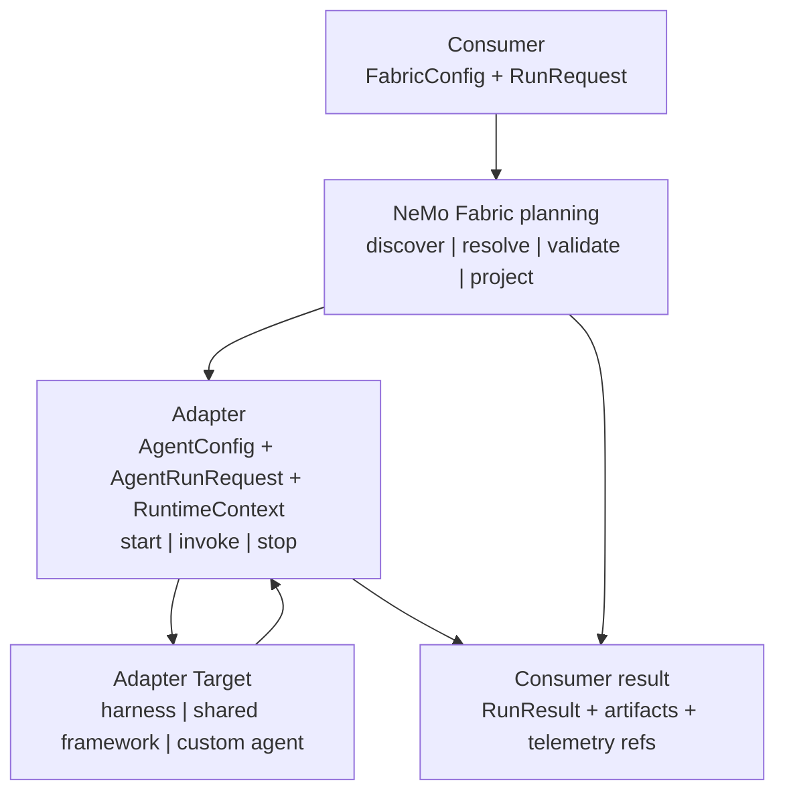

{/*
SPDX-FileCopyrightText: Copyright (c) 2026, NVIDIA CORPORATION & AFFILIATES. All rights reserved.
SPDX-License-Identifier: Apache-2.0
*/}

# NVIDIA NeMo Fabric Adapter Contract

An adapter makes an agent harness or custom agent available through the same
NVIDIA NeMo Fabric configuration, lifecycle, and result APIs. Fabric consumers
can then change Adapter Targets without adding target-specific launch and
control code to every application, evaluator, or rollout system.

An **Adapter Target** is the harness, framework, custom agent, or remote service
behind an adapter. The adapter translates the NeMo Fabric contract into that
target's native configuration and execution model.

## Why Build an Adapter

A Fabric-ready Adapter Target gains the following benefits:

- One consumer-facing `FabricConfig` and runtime lifecycle
- Compatibility checks before target code starts
- Isolated, ordered runtime state
- Normalized failures, artifacts, results, and telemetry references
- Optional NeMo Relay streaming without a target-specific streaming method

The adapter remains small because NeMo Fabric owns planning, environment
preparation, adapter selection, correlation, and consumer-facing enrichment.
The adapter owns only target translation, target state, invocation, and
cleanup.

The following diagram shows the adapter contract flow from consumer planning
through the adapter and Adapter Target to the consumer result:

## Choose an Integration Shape

Use the narrowest reusable adapter boundary that your target provides:

| Integration Shape | Use It When | Adapter Reuse | Reference |
| --- | --- | --- | --- |
| Harness adapter | An opinionated harness supplies a stable construction and execution model. | One adapter supports many configurations of that harness. | [Hermes Agent](https://github.com/NVIDIA/NeMo-Fabric/tree/main/adapters/hermes); [mini-SWE-agent](https://github.com/NVIDIA/NeMo-Fabric/tree/main/adapters/mini-swe-agent) for the minimum surface |
| Shared framework adapter | A framework can load multiple registered custom agents through stable entry-point semantics. | One adapter supports many separately installed targets. | [NeMo Agent Toolkit](https://github.com/NVIDIA/NeMo-Fabric/tree/main/external/nat) |
| Dedicated custom-agent adapter | The application owns execution behavior that does not fit a reusable loading contract. | One adapter packages one custom agent or agent family. | [LangGraph email-phishing analyzer](https://github.com/NVIDIA/NeMo-Fabric/tree/main/examples/langgraph_custom_agent) |

A custom agent does not automatically need a dedicated adapter. A shared
adapter is appropriate when a framework has stable loading and invocation
semantics.
Use a dedicated adapter when the agent itself is the only clear execution
boundary. Refer to [Custom Agents](custom-agents.md) for the decision model.

Use Hermes Agent as the primary harness-adapter reference. Start with
mini-SWE-agent when implementing a first adapter: it intentionally keeps the
required descriptor, configuration translation, and lifecycle surface small.

## Implement the Minimum Surface

The minimum local adapter has four parts:

1. One discoverable `*.fabric-adapter.json` descriptor.
2. `start`, which initializes one isolated target runtime from `AgentConfig`.
3. `invoke`, which executes exactly one request and returns one terminal
   `AgentRunResult`. A runtime can perform zero or more ordered `invoke`
   operations.
4. `stop`, which attempts cleanup after successful, partial, or failed work.

The minimum profile permits one active invocation per runtime. It does not
require an adapter-managed queue, concurrent turns, native streaming,
cancellation, or live updates. Consumers create independent Fabric runtimes
for parallel work.

`Runtime.invoke_stream()` also does not add an adapter method. The adapter runs
ordinary `invoke` while NVIDIA NeMo Relay supplies correlated Agent Trajectory
Observability Format (ATOF) records to the consumer.

## Build in Stages

Follow these stages in order and stop when the target has the behavior it
needs:

| Stage | Add | Done When |
| --- | --- | --- |
| 1. [Describe the adapter](adapter-descriptor.md) | Identity, runtime binding, minimum descriptor, and optional target records. | NeMo Fabric can discover and validate metadata without importing adapter code. |
| 2. [Map configuration](normalized-configuration.md) | Only the normalized `AgentConfig` fields and typed settings the target applies. | Unsupported behavior fails planning instead of being ignored. |
| 3. [Implement execution](execution.md) | `start`, `invoke`, `stop`, runtime isolation, and safe failures. | One runtime can execute an ordered request sequence and always attempts cleanup. |
| 4. [Normalize outcomes](results.md) | `AgentRunResult`, error translation, artifacts, and telemetry integration. | Every completed target invocation has one safe terminal outcome. |
| 5. [Package and register](registration-and-discovery.md) | Installed descriptor files or explicit development paths. | Planning resolves the intended adapter and optional registered target by exact ID. |
| 6. [Verify the adapter](conformance.md) | Planning, lifecycle, cleanup, isolation, and declared capability tests. | The minimum profile and every descriptor claim have evidence. |

Add [native OpenAI Chat Completions streaming](openai-streaming.md) only after
the required lifecycle works. It is an optional adapter capability and is
independent of Relay-backed ATOF streaming.

## Use the Published Contract

The repository documentation and versioned schemas are the source of truth.
Use examples to understand the boundary, but do not recreate types from an
example:

- [`schemas/adapter-contract/`](https://github.com/NVIDIA/NeMo-Fabric/tree/main/schemas/adapter-contract) contains the
  canonical JSON Schemas.
- `nemo-fabric-adapter-contract` provides dependency-free Python dataclasses
  with optional Pydantic interoperability.
- The TypeScript `nemo-fabric-adapter-contract` package provides generated
  compile-time types and bundles the JSON Schemas for runtime validation.
- [`nemo-fabric-build-adapter`](https://github.com/NVIDIA/NeMo-Fabric/blob/main/skills/nemo-fabric-build-adapter/SKILL.md)
  is the public coding-agent skill for adapter authoring.
- [Examples and References](examples.md) identifies the exact files to read for
  each integration shape.

The current contract version is `fabric.adapter/v1alpha2`. The same
`contract_version` covers Adapter Descriptors, Adapter Target Descriptors,
`AgentConfig`, `RuntimeContext`, and the negotiated lifecycle binding. Adapter
package versions are independent implementation-release versions.
