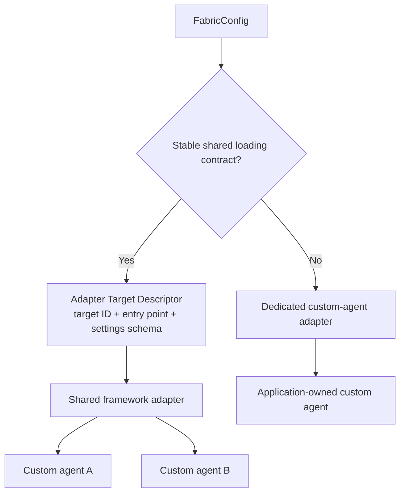

{/*
SPDX-FileCopyrightText: Copyright (c) 2026, NVIDIA CORPORATION & AFFILIATES. All rights reserved.
SPDX-License-Identifier: Apache-2.0
*/}

# Choose a Custom-Agent Integration

An agent harness supplies a reusable execution model. Its users customize the
harness through supported models, instructions, tools, MCP servers, skills,
plugins, and settings.

A custom agent owns application-specific execution behavior. Its code defines
the graph, state transitions, control flow, or other runtime semantics. NVIDIA
NeMo Fabric cannot infer those semantics statically, so the integration must
provide an unambiguous construction boundary.

Use either a shared framework adapter or a dedicated custom-agent adapter:



## Use a Shared Framework Adapter

Choose a shared adapter when a framework provides stable target loading,
construction, invocation, and cleanup semantics. One adapter can then translate
normalized configuration once and support many separately installed custom
agents.

Each custom agent publishes an Adapter Target Descriptor with:

- A globally stable `id` selected by `FabricConfig.workflow.target_id`
- An `adapter_id` that selects the shared adapter
- An adapter-scoped `spec.entrypoint`
- A closed `spec.settings_schema` for the agent's construction settings

The consumer selects the registered target and provides settings:

```python
FabricConfig(
    workflow=WorkflowConfig(
        target_id="nvidia.examples.nat.email-phishing-analyzer",
        settings={
            "llm_name": "default",
            "use_native_tool_calling": True,
        },
    ),
    models={"default": ModelConfig(...)},
)
```

Planning resolves the target before it resolves the adapter. It validates the
settings, then projects the target-owned entry point and consumer settings into
`AgentConfig.workflow`:

```python
AgentWorkflowConfig(
    entrypoint=AgentWorkflowEntrypointConfig(
        kind="factory",
        ref="fabric.agent.react",
    ),
    settings={
        "llm_name": "default",
        "use_native_tool_calling": True,
    },
)
```

`entrypoint.kind` selects resolution semantics defined by that shared adapter.
`entrypoint.ref` identifies the factory within those semantics. The v1alpha2
contract does not define a global catalog of entry-point kinds and does not
permit consumers to bypass target registration with a direct entry point.

The [NeMo Agent Toolkit reference adapter](https://github.com/NVIDIA/NeMo-Fabric/tree/main/external/nat)
implements the current shared-adapter example. Its registered targets use
`kind: factory` and `ref: fabric.agent.react`. The adapter then maps that
portable intent to the NeMo Agent Toolkit ReAct workflow factory.

## Keep Workflow Settings Agent-Specific

`workflow` is the `AgentConfig` block for immutable custom-agent construction:

- `workflow.entrypoint` comes from the selected Adapter Target Descriptor.
- `workflow.settings` comes from `FabricConfig.workflow.settings` after schema
  validation.

Runtime and invocation identity comes from `RuntimeContext`. Per-invocation
input comes from `AgentRunRequest`. Neither belongs in workflow settings.

The shared adapter owns translation of normalized models, instructions, tools,
MCP servers, skills, and runtime behavior into target-native construction
values. A custom-agent factory should receive native dependencies or an
adapter-defined build context. It should not parse `FabricConfig` or implement
the adapter's `AgentConfig` mapping again.

An intentionally open workflow settings schema can preserve compatibility with
an existing framework configuration, but NeMo Fabric cannot validate its fields
or vary them portably. Use a closed schema and keep
models, tools, MCP servers, and other normalized capabilities in their
dedicated `AgentConfig` blocks.

## Use a Dedicated Custom-Agent Adapter

Choose a dedicated adapter when the agent does not fit a stable shared loading
contract. Selecting the adapter already identifies how the application-owned
agent is constructed, so the adapter does not need an artificial
`workflow.entrypoint`.

The dedicated adapter can still accept normalized models, instructions, MCP
servers, tools, skills, and runtime limits. Its descriptor declares only the
fields that this agent applies. `start` builds and retains the custom agent,
`invoke` executes it, and `stop` releases its resources.

The
[LangGraph email-phishing analyzer](https://github.com/NVIDIA/NeMo-Fabric/tree/main/examples/langgraph_custom_agent)
is the dedicated reference. The LangGraph application has no NeMo Fabric
dependency; the adjacent adapter translates `AgentConfig`, owns the compiled
graph lifecycle, and returns terminal JSON-compatible output.

## Decide Before You Implement

Use these questions to choose the boundary:

- Can one adapter locate and construct multiple agents without agent-specific
  implementation code?
- Can the adapter define stable meanings for each target entry-point kind?
- Can every target publish a bounded workflow settings schema?
- Can the adapter translate normalized capabilities once for all targets?

If all answers are yes, build a shared adapter and register targets separately.
Otherwise, build a dedicated adapter and keep the target construction logic
explicit.

Refer to [Examples and References](examples.md) for the exact files that
demonstrate both paths.
