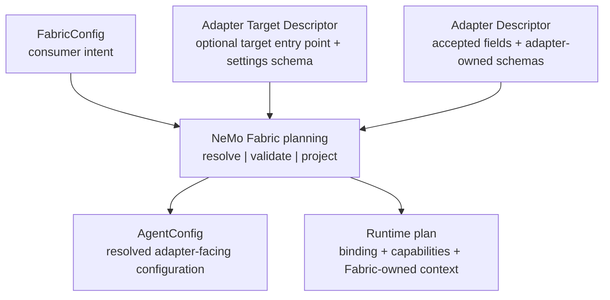

{/*
SPDX-FileCopyrightText: Copyright (c) 2026, NVIDIA CORPORATION & AFFILIATES. All rights reserved.
SPDX-License-Identifier: Apache-2.0
*/}

# Stage 2: Map Normalized Configuration

Consumers describe intent with `FabricConfig`. During planning, NVIDIA NeMo
Fabric resolves descriptors, validates compatibility, and projects only the
configuration that the selected adapter declared into `AgentConfig`.

Adapters consume `AgentConfig`. They do not parse `FabricConfig` or
consumer-owned planning fields.



The smallest valid `AgentConfig` is empty. Add a block only when the adapter
needs and applies it.

## Understand the Blocks

`AgentConfig` contains these adapter-facing blocks:

| Block | Purpose |
| --- | --- |
| `harness` | Adapter-wide settings validated by the Adapter Descriptor. |
| `models` | Named model roles with provider, model, credential-variable name, endpoint, temperature, and provider settings. |
| `instructions` | Portable target instructions. |
| `runtime` | Target-applied behavior, such as a turn limit. |
| `skills` | Skill paths resolved for the execution environment. |
| `mcp` | Named Model Context Protocol (MCP) servers, authentication metadata, headers, and effective per-server tool policy. |
| `tools` | Named tool or tool-group definitions plus effective enabled and blocked policy. |
| `workflow` | A registered custom-agent entry point and immutable construction settings. |
| `extensions` | Adapter-owned data validated at a declared extension point. |

Use the canonical
[`agent-config.schema.json`](https://github.com/NVIDIA/NeMo-Fabric/blob/main/schemas/adapter-contract/agent-config.schema.json)
for exact fields and constraints. Python adapters can use the matching
dependency-free dataclasses from `nemo_fabric_adapter_contract.models`.

## Project Only Supported Fields

The Adapter Descriptor, capability plan, and optional Adapter Target Descriptor
control projection. Planning applies these rules:

1. Use `config.accepts` to gate adapter-applied model configuration, system
   instructions, maximum turns, tool definitions, enabled tools, and blocked
   tools.
2. Validate every configured model role against `model_schema` when the
   descriptor supplies one.
3. Validate `harness.settings` against the Adapter Descriptor's
   `settings_schema`, then project the validated settings when present.
4. Validate `workflow.settings` against the selected Adapter Target
   Descriptor, then project that target's entry point into `workflow`.
5. Validate every named tool definition against `tool_definition_schema`.
6. Project skills and MCP servers assigned to the adapter by the capability
   plan.
7. Validate adapter-owned extensions against the schema for their exact
   extension point.
8. Reject configured behavior that the selected adapter cannot apply.

Unsupported behavior fails planning with a field path and reason. It is never
silently dropped.

An absent optional field can preserve the target's default. An explicitly
empty value can mean something different. For example,
`tools.enabled: null` preserves the target's native selection, while
`tools.enabled: []` explicitly selects no named tools.

## Keep Fabric-Owned Context Out of AgentConfig

`AgentConfig` does not contain adapter selection, installation policy,
environment ownership, invocation deadlines, artifact manifests, or planning
diagnostics. NeMo Fabric also resolves telemetry and Relay configuration
outside `AgentConfig`. When enabled, `RuntimeContext.telemetry` supplies the
adapter with the generated Relay configuration path, environment overlay, and
telemetry metadata needed for the invocation.

Credential fields contain environment-variable names, not resolved secret
values. Environment values can be available in
`RuntimeContext.environment.env`. Never persist or log the unredacted context.

## Translate Once at the Boundary

Keep translation in a small adapter-owned function. The following
representative code assumes the adapter's documented consumer configuration
requires a model named `default`, then resolves that model and the system
instruction into target-native values:

```python
def build_target(config: AgentConfig):
    model = config.models["default"]
    return TargetAgent(
        model=create_model(
            provider=model.provider,
            name=model.model,
            base_url=model.base_url,
            temperature=model.temperature,
        ),
        instructions=(
            config.instructions.system.content
            if config.instructions and config.instructions.system
            else None
        ),
    )
```

The descriptor must accept every field used by this translation. Do not read
undeclared values defensively or fall back to parsing the original
`FabricConfig`.

## Use Extensions Deliberately

Use an extension only when a normalized field cannot express the behavior:

1. Define a typed model for the adapter-owned data.
2. Publish its JSON Schema in `AdapterDescriptor.extension_schemas` at the
   exact extension point, such as `model`, `mcp_server`, `workflow`, or
   `run_result`.
3. Set the value through the corresponding block's `extensions` map or helper.
4. Reject data when the descriptor does not declare that extension point or
   the value does not satisfy its schema.

Do not use an extension to disguise an unsupported normalized field. An
extension is adapter-specific unless multiple adapters intentionally implement
the same namespaced contract.

## Split Static and Startup Validation

Planning validates static shape and compatibility without executing adapter
code. During `start`, the adapter validates only requirements that depend on
the target environment, such as imports, installed factories, executable
presence, credential availability, and service reachability. Report the
failing requirement or configuration field without exposing secret values.

After the mapping is defined, [implement the required lifecycle](execution.md).
