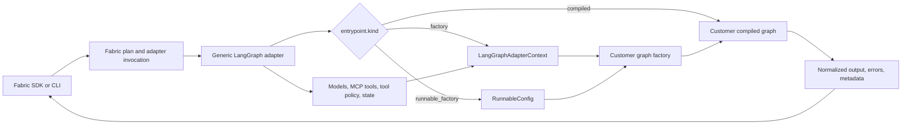

<!--
SPDX-FileCopyrightText: Copyright (c) 2026, NVIDIA CORPORATION & AFFILIATES. All rights reserved.
SPDX-License-Identifier: Apache-2.0
-->

# NVIDIA NeMo Fabric LangGraph Adapter Design

**Status:** Draft for alignment, with a working proof of concept.

This document proposes the architecture for LangGraph support in NVIDIA NeMo
Fabric. A proof-of-concept implementation accompanies it at
[`adapters/langgraph/`](../../adapters/langgraph/README.md), validated against two
representative custom LangGraph agents at
[`examples/langgraph/`](../../examples/langgraph/README.md). The proof of concept
does not change any existing Fabric public API.

## Decision Summary

Add **one** generic Python adapter with the stable adapter ID
`nvidia.fabric.langgraph` and the distribution name
`nemo-fabric-adapters-langgraph`. It loads a customer-owned LangGraph graph by an
explicit Python reference, invokes it through the existing Fabric adapter
lifecycle, and returns a normalized Fabric result.

The adapter supports three explicit binding kinds:

- **`compiled`** runs a graph exported by the agent unchanged. It is the default
  and has the smallest integration cost.
- **`factory`** passes a small, adapter-owned context to an agent factory. The
  factory can opt into Fabric-managed models, MCP tools, tool policy,
  persistence, telemetry hooks, and result normalization.
- **`runnable_factory`** calls a factory with a LangGraph `RunnableConfig`. This
  is the entry-point shape the NVIDIA NeMo Agent Toolkit `langgraph_wrapper`
  accepts, so one graph can run in both systems.

Use configuration for graph selection and input/output differences. Use the
factory context for LangGraph-specific behavior. Add a dedicated adapter only
when the generic lifecycle and context cannot represent the agent without
changing Fabric-wide behavior.

## Source Material Note

Two internal documents were cited as inputs to this design: a NeMo Agent Toolkit
third-party adapter proposal and a Fabric adapter contract proposal. Both Google
Docs return HTTP 401 to an unauthenticated fetch and could not be read while
writing this document.

This design is therefore grounded in sources that could be verified directly:

- The **published** NeMo Agent Toolkit third-party plugin and LangGraph guides
  (see [References](#references)), which document the ownership model, naming
  convention, tier ladder, support boundaries, and the `langgraph_wrapper`
  entry-point contract.
- The **actual** Fabric adapter contract in this repository: the descriptor
  schema (`schemas/adapter-descriptor.schema.json`), descriptor discovery and
  capability routing (`crates/fabric-core/src/config.rs`), the Python adapter
  invocation path (`crates/fabric-core/src/runtime.rs`), and the existing
  LangChain-family precedent (`adapters/deepagents/`).

Where the internal documents disagree with what is recorded here, the internal
documents should win on ownership and process, and this document should be
corrected. The technical contract sections reflect code that was read and
executed, so they should be treated as the current ground truth.

## Goals

The adapter must:

- Run at least two representative custom LangGraph agents with one adapter
  package and one adapter ID.
- Let a simple custom agent run without code changes when it already exports a
  compatible compiled graph.
- Let an opting-in custom agent consume normalized Fabric configuration without
  importing Fabric internals.
- Preserve the current Fabric lifecycle: resolve, prepare, start, invoke, stop.
- Surface normalized output, errors, runtime identifiers, and metadata through
  `RunResult`, and report an unfinished run as unfinished rather than as a
  success or as an unrelated projection error.
- Be releasable and supportable as a third-party adapter, even while its first
  versions reside in this repository.

## Non-Goals

The first release does not:

- Replace LangGraph's graph, state, checkpoint, deployment, or Studio APIs.
- Infer a graph's state schema, node semantics, tool definitions, or safe
  permission boundary by inspecting its Python objects.
- Promise that a precompiled graph's internally created models, tools, or
  checkpointer follow Fabric configuration.
- Provide live event streaming, cancellation, service lifecycle operations, or
  interactive interrupt and resume. Fabric's current Python adapter runtime
  invokes an adapter to completion and returns one `RunResult`.
- Add a general-purpose arbitrary-Python escape hatch to JSON configuration.

## Existing Constraints

Fabric already supplies most of what a generic adapter needs:

- Adapter descriptors select a Python module and declare accepted Fabric
  configuration areas.
- The adapter invocation includes the complete typed configuration, normalized
  capability and telemetry plans, request input, runtime ID, environment, and
  artifact manifest.
- A started Fabric runtime keeps a stable `runtime_id` across invocations.
- `adapters/deepagents/` demonstrates normalized model, MCP, tool-policy,
  telemetry, and persistent-state handling for a LangGraph-based harness.

Two constraints shape the design.

**Descriptor discovery is filesystem-only.** `AdapterRegistry::from_config` scans
the Fabric repository's `adapters/` directory and a consumer project's
`<base_dir>/adapters/` directory. It does not read descriptors from an installed
Python distribution, even though adapter wheels already package one at
`share/nemo-fabric/adapters/<name>/`. The in-tree proof of concept is discovered
through repository scanning, but a published package needs either a project-local
descriptor deployment step or a descriptor-discovery enhancement.

**`runner.callable` is documentation, not wiring.** The Python runtime runs
`python -m <runner.module>` and communicates over stdin and stdout JSON; it never
imports the named callable. The adapter must therefore expose a `__main__` entry
that reads the payload, prints one JSON object, and exits non-zero on failure.

A third constraint bounds what the adapter can promise about artifacts.
`promote_relay_artifacts_to_manifest` is the only path from adapter output into
`RunResult.artifacts`, and it accepts only the `atof` and `atif` kinds from a
`relay_artifacts` list. An adapter therefore **cannot** register an arbitrary
adapter-created file, such as a checkpoint database, as a first-class Fabric
artifact today. The adapter reports such paths as result metadata instead, and
first-class artifact registration waits on either a validated telemetry provider
or a general adapter-artifact key.

## Third-Party Ownership Model

The ownership model follows the published NeMo Agent Toolkit third-party plugin
model where it applies: the integration owns its package, compatibility range,
release process, CI, documentation, and provider-specific behavior. NVIDIA NeMo
Fabric owns the adapter descriptor contract, the normalized invocation and result
contracts, and defects in those shared contracts.

The implementation differs from the NeMo Agent Toolkit's plugin model
deliberately, because the two runtimes extend differently.

| Concern | NeMo Agent Toolkit | NeMo Fabric LangGraph adapter |
| --- | --- | --- |
| Discovery | `importlib.metadata` entry points in the `nat.plugins` group | Filesystem descriptor scan of `adapters/` directories |
| Registration | Decorators register components into a toolkit-wide registry | A descriptor selects one adapter; no Fabric-wide LangGraph registry |
| Integration unit | A workflow type (`langgraph_wrapper`) inside the toolkit process | A Fabric adapter subprocess with a JSON invocation contract |
| Resource injection | Ambient builder accessor (`SyncBuilder.current().get_llm(...)`) | An explicit `LangGraphAdapterContext` argument, with an ambient accessor as a compatibility shim |
| Agent path setup | `dependencies` list appended to `sys.path` | `entrypoint.search_paths`, resolved relative to `base_dir` and confined to it |
| Public authoring surface | `nat.plugin_api` | `LangGraphAdapterContext` plus `nemo-fabric-adapters-common` |

The naming convention mirrors the toolkit's one-token-everywhere rule: the token
`langgraph` is used for the directory, the harness name, the descriptor, the
import namespace, and the adapter ID suffix.

During incubation, host the package at `adapters/langgraph/` but keep these
external-package seams:

- Publishable distribution: `nemo-fabric-adapters-langgraph`.
- Import namespace: `nemo_fabric_adapters.langgraph`.
- Descriptor: `fabric-adapter.json`, adapter ID `nvidia.fabric.langgraph`,
  harness `langgraph`, adapter kind `python`.
- Public adapter-authoring surface: `LangGraphAdapterContext` plus
  `nemo-fabric-adapters-common`. No Fabric private modules.
- Optional dependency extras (`models`, `mcp`, `state`) so an agent installs only
  the LangChain surface it actually uses.
- Compatibility policy: test the declared Fabric and LangGraph ranges in the
  adapter's own CI. Keep the initial in-tree version pinned to the matching
  Fabric release until an external compatibility policy is agreed.

Before publication, choose one descriptor-discovery path:

1. **Recommended:** extend Fabric with installed-descriptor discovery, using a
   documented package metadata or resource contract. This is the equivalent of
   the toolkit's entry-point discovery experience, and it also removes the
   existing packaging workaround recorded in `TODO.md`.
2. **Transitional:** have the application deploy the package's descriptor to
   `<base_dir>/adapters/langgraph/fabric-adapter.json`. Document this as a
   deployment requirement, not as automatic package discovery.

The first option is required for frictionless third-party distribution, but it
need not block the proof of concept.

## Recommended Architecture

The generic adapter owns process-level concerns and the graph binding. The custom
agent owns its graph topology, state schema, prompts, application tools, and
domain behavior.



The adapter executes these stages for every invocation:

1. Validate `harness.settings.langgraph`, failing closed on unknown keys.
2. Reject capabilities the selected binding kind cannot honor.
3. Derive the LangGraph thread ID from the Fabric runtime ID and, for
   `state: adapter`, open the adapter-owned checkpointer and ask it whether this
   thread is a resume.
4. Build the runnable configuration and the `LangGraphAdapterContext`.
5. Import the entry point and construct the graph, with the context published for
   the duration of construction.
6. Convert the Fabric request into graph input using the configured mapping.
7. Stream the graph so token usage is attributable to this turn, buffering a
   bounded event summary.
8. Detect a pending interrupt before projecting output, and report an incomplete
   run instead of a partial success.
9. Project the final state into a normalized, JSON-safe response.
10. Return failures as normalized adapter results, without exposing credentials or
    raw tracebacks.

The adapter does not cache a customer graph globally. A factory constructs its
graph from the current runtime context, and adapter-owned state resources are
opened and closed deterministically for each invocation.

### Package Layout

```text
adapters/langgraph/
├── fabric-adapter.json
├── pyproject.toml
├── README.md
├── LICENSE
└── src/nemo_fabric_adapters/langgraph/
    ├── __init__.py      # public surface: LangGraphAdapterContext, current_context
    ├── adapter.py       # Fabric lifecycle translation and orchestration
    ├── config.py        # validated harness.settings.langgraph
    ├── context.py       # public LangGraphAdapterContext contract
    ├── loading.py       # explicit entry-point loading and shape validation
    ├── models.py        # Fabric model aliases to LangChain chat models
    ├── tools.py         # MCP conversion and tool policy
    ├── state.py         # runtime-to-thread mapping and checkpointers
    └── normalize.py     # input, message, and output projection
```

The location is temporary; the module and distribution names are not. The
custom-agent contract is not coupled to the in-tree directory layout.

## Graph Binding Contract

The adapter uses an explicit binding kind rather than inspecting a callable's
signature. This makes configuration reviewable and failures clear.

```python
from nemo_fabric import HarnessConfig

config.harness = HarnessConfig(
    adapter_id="nvidia.fabric.langgraph",
    resolution="preinstalled",
    settings={
        "langgraph": {
            "entrypoint": {"target": "my_agent.graph:graph", "kind": "compiled"},
            "input": {"mode": "messages"},
            "output": {"mode": "last_message"},
        }
    },
)
```

| Binding kind | Entry-point value | Use case | Fabric integration level |
| --- | --- | --- | --- |
| `compiled` | A compiled graph with `invoke` or `ainvoke`. | An existing graph that already owns its dependencies. | Execution and normalization only. |
| `factory` | `callable(LangGraphAdapterContext) -> compiled graph`, sync or async. | A graph that wants Fabric-managed resources. | Full opt-in to the context contract. |
| `runnable_factory` | `callable(RunnableConfig) -> compiled graph`. | A graph already written for the NeMo Agent Toolkit `langgraph_wrapper`. | Execution plus the Fabric thread ID. |

The adapter rejects an entry point of the wrong kind before invoking the graph,
and names the correct kind in the error. It resolves a module through the normal
interpreter import path; `entrypoint.search_paths` may add directories, but they
must be relative to `base_dir`, must not escape it, and are **appended** to
`sys.path` rather than prepended, so an agent directory cannot shadow the standard
library or an installed package. The application is responsible for installing the
custom agent package in the adapter's Python environment.

`search_paths` is the counterpart to the toolkit's `dependencies` list, which is
what makes an unpackaged agent directory usable without code changes. It is
narrowed relative to the toolkit's behavior because Fabric treats agent
configuration as trusted but still should not let configuration reach arbitrary
host locations.

### Declarative Configuration

The `langgraph` settings accept only documented JSON-compatible values, and
reject unknown keys so a typo is an error rather than silently ignored intent.

| Area | Configuration | Purpose |
| --- | --- | --- |
| Entry point | `entrypoint.target`, `entrypoint.kind`, `entrypoint.search_paths` | Selects the graph or factory and makes it importable. |
| Input | `passthrough`, `messages`, or `field` | Forwards JSON unchanged, wraps a text request as a user message, or places text in a named state field. |
| Output | `last_message`, `field`, or `state` | Selects the primary normalized response without agent code. |
| Events | `none` or `summary`, plus a bounded limit | Controls the buffered, post-completion diagnostic summary. |
| State | `none`, `graph`, or `adapter` | Declares who owns checkpoint persistence. |
| Agent settings | `agent` JSON object | Provides domain configuration to a factory without giving Fabric semantics to those fields. |
| Recursion | `recursion_limit` | Passes LangGraph's recursion limit through. |

`passthrough` is the default and is what makes an existing compatible graph
usable as-is. `messages` and `field` require a text request and reject structured
input instead of silently coercing it. Output `field` and `state` support graphs
that do not keep a message list; `last_message` fails with the available state
fields listed when no message list exists.

Do not add callable import strings for input transforms, output transforms, or
tool factories to configuration. Those behaviors belong in the graph factory,
where they are versioned and tested with the agent.

## Factory Context and Extension Points

Factory mode has one small public contract:

```python
from nemo_fabric_adapters.langgraph import LangGraphAdapterContext


def build_graph(context: LangGraphAdapterContext):
    model = context.chat_model("default")
    tools = [*context.mcp_tools(), *context.guard_tools([my_local_tool])]
    workflow = compile_my_graph(model=model, tools=tools, **context.agent_settings)
    return workflow.compile(checkpointer=context.checkpointer)
```

| Context surface | Provides | Contract boundary |
| --- | --- | --- |
| `chat_model(alias)` | A LangChain chat model from a Fabric model alias, memoized per invocation. | Provider scope matches the Deep Agents adapter: NVIDIA and OpenAI-compatible endpoints, then an explicit `init_chat_model` fallback. |
| `mcp_tools()` | LangChain tools from Fabric MCP servers routed as `harness_native`, with policy already applied. | The adapter validates MCP transport and fails closed on invalid configuration. |
| `guard_tools(tools)` | Policy-wrapped tools that enforce `tools.blocked`. | Protection applies only to tools passed through this helper. |
| `checkpointer`, `runnable_config`, `thread_id` | Adapter-owned persistence and the configured LangGraph thread. | The factory must compile with the supplied checkpointer and merge, not replace, the runnable configuration. |
| `workspace`, `artifact_dir` | Resolved Fabric environment paths. | The graph must enforce any filesystem confinement it needs. |
| `callbacks` | Telemetry callbacks to merge with the graph's own. | Empty until a telemetry provider is validated and declared. |
| `agent_settings`, `agent_name`, `blocked_tool_names` | Read-only, JSON-shaped configuration. | Fabric does not interpret domain fields beyond JSON compatibility. |

The context does not expose Fabric private classes, unredacted credentials, or
mutable runtime internals.

`current_context()` is a compatibility shim for an agent that builds its graph
from ambient configuration rather than an explicit argument, which is the shape
the toolkit's builder accessor supports. It is valid only while the adapter is
constructing the graph and raises a clear error otherwise. A `factory` entry
point is preferred because it makes the dependency explicit and testable.

An agent can add application-specific behavior using `agent_settings`, its own
package configuration, and ordinary LangGraph code. A new Fabric adapter is not
needed for a new prompt, state schema, node, subgraph, application tool,
retriever, routing policy, or output field.

## State, Telemetry, and Tool Policy

### State and Resume

The LangGraph `thread_id` is derived deterministically from the Fabric
`runtime_id`, so every `invoke` on one started runtime continues the same thread,
separate runtimes stay isolated, and no adapter-owned correlation file can drift
from reality. For `state: adapter` the adapter opens a SQLite checkpointer beneath
the configured artifact or state directory, asks it whether the thread already has
committed state to report `resumed` accurately, and hands both the checkpointer
and the runnable configuration to the factory.

`state: graph` passes the stable thread ID to a graph that owns its own
checkpoint storage. `state: none` runs without persistence. A compiled graph
cannot be retrofitted with a new checkpointer, so `state: adapter` is rejected for
`compiled` and `runnable_factory` entry points.

### Telemetry and Events

The first descriptor declares **no** telemetry provider. Fabric still records its
own lifecycle, but the adapter must not claim graph-level telemetry before a
provider has a passing end-to-end test against the selected LangGraph and NeMo
Relay versions. `context.callbacks` is the merge point for when it does.

The adapter streams the graph so token usage can be attributed to the current
turn, which matters on a resumed thread whose final state replays earlier turns.
Messages are de-duplicated by id, because a node that returns its whole message
list rather than only new messages would otherwise have earlier messages counted
again on every step. Events are always bounded; `events: summary` reports them
after completion. This is not Fabric progressive streaming.

The adapter deliberately does **not** stream with `subgraphs=True`, unlike the
Deep Agents adapter. A composed LangGraph subgraph merges its output into the
parent state, so the parent's node update already carries the subgraph's messages;
enabling subgraph streaming emits them a second time and also emits subgraph-level
final-state chunks that would overwrite the root graph's final state. Deep Agents
needs it because a delegated subagent runs in a separate state channel. The
consequence for LangGraph is that a subgraph which does not merge its messages
into the parent state contributes no usage, which is a documented limitation
rather than a silent miscount.

### Interrupts

A graph that calls `interrupt()` returns normally, recording the pending interrupt
under a private `__interrupt__` state key rather than raising. Without explicit
handling this is actively misleading: output projection would either report
success on a partial state or fail with an unrelated error about the field the
graph never reached. The adapter therefore checks for pending interrupts before
projecting output and returns a normalized incomplete result that names the
interrupt, reports `interrupted`, and includes each JSON-safe interrupt payload.
Under `state: graph` or `state: adapter` the thread stays checkpointed, so
LangGraph can resume it directly even though Fabric has no interaction contract
to answer it.

### Tools and Permissions

Fabric can enforce `tools.blocked` only for tools it wraps. A precompiled graph
that creates its own tools is runnable, but Fabric cannot inspect or deny those
calls, so the adapter **rejects** a configuration that asks for `tools.blocked` or
supplies Fabric MCP servers to a `compiled` or `runnable_factory` entry point
rather than reporting a policy it cannot enforce.

Factory graphs build their tool surface from `context.mcp_tools()` and
`context.guard_tools(...)`. A blocked tool is replaced by a deny stub that keeps
the original name and schema, so the graph's tool surface does not change shape
and a hardcoded reference receives an explicit policy message instead of an
unknown-tool failure. The original implementation never runs. A factory that
intentionally uses unwrapped application tools documents and owns that boundary.

## Design Validation

Two representative custom agents validate the boundary. Both are real LangGraph
`StateGraph` agents, and both run through `nvidia.fabric.langgraph` with no
agent-specific adapter.

| Agent | Graph characteristics | Adapter configuration | Result |
| --- | --- | --- | --- |
| [`triage_agent`](../../examples/langgraph/triage_agent/graph.py) | Custom state schema, conditional routing to an escalation or drafting node, own prompts, own chat model built from its own environment variables, compiled at import time. Does not import Fabric. | `compiled`, `input: field(ticket)`, `output: last_message`, `state: none`. | Runs unchanged. No agent-specific adapter is required. |
| [`case_review_agent`](../../examples/langgraph/case_review_agent/graph.py) | Routed research and review nodes, a domain `answer` state field, multi-turn accumulation, an application tool alongside Fabric MCP tools. | `factory`, `input: messages`, `output: field(answer)`, `state: adapter`, Fabric model alias, MCP servers, and `tools.blocked`. | Uses the same adapter through the context contract; receives configuration, durable thread state, and enforced policy. |

The validation suite at
[`tests/adapters/test_langgraph_adapter.py`](../../tests/adapters/test_langgraph_adapter.py)
runs these as real compiled graphs; the only substituted component is the chat
model, so the topology, state reducers, routing, tool calls, and SQLite checkpoint
persistence under test are the real ones. It covers, and the current
implementation passes:

- Compiled mode running an unmodified graph, with `last_message`, `field`, and
  JSON-safe `state` projection, and `passthrough` input.
- Compiled mode failing clearly when asked for `tools.blocked`, Fabric MCP
  servers, or `state: adapter`, and succeeding with `state: graph`.
- Factory mode binding a Fabric model alias, loading MCP tools, and projecting a
  domain field.
- Tool policy denying a blocked **application** tool and a blocked **MCP** tool
  without either one executing, while unblocked tools still run.
- State reuse across two invocations on one runtime, including accurate `resumed`
  reporting, and isolation between distinct runtimes.
- An interrupting graph reporting an incomplete run with its interrupt payload and
  a preserved checkpoint, rather than a partial success.
- A multi-agent graph composing a local subgraph, with the subgraph's tokens
  counted exactly once.
- The `runnable_factory` shape receiving Fabric's thread ID through a
  `RunnableConfig`, and the ambient `current_context()` shim.
- Entry-point loading failures: unimportable module, missing attribute, wrong
  declared kind in both directions, a factory returning a non-graph, and
  `search_paths` that are absolute or escape `base_dir`.
- Settings validation failing closed across unknown keys, malformed targets,
  unsupported modes, and non-JSON agent settings.

Both agents were additionally run end to end through the real Fabric runtime —
descriptor discovery, the `python -m` subprocess, and a normalized `RunResult` —
by [`tests/e2e/test_langgraph.py`](../../tests/e2e/test_langgraph.py). The
compiled agent runs there without credentials, using the escalation branch that
needs no model call. The factory agent was run against a live NVIDIA endpoint,
confirming that it received the configured model alias rather than its own client
and that a started runtime resumed the same LangGraph thread across two turns.

These cases deliberately cover both ends of the intended support range. A
multi-agent graph that composes local LangGraph subgraphs also fits factory mode,
because the top-level factory can construct its subgraphs from the same context;
the validation suite covers that case directly. Remote subgraphs remain a
limitation because their internal tools, telemetry, and state are outside the
local adapter process.

## Configuration, Extension, or Dedicated Adapter

Use the following decision rules when onboarding an agent:

| Need | Preferred choice | Rationale |
| --- | --- | --- |
| Select an importable graph, choose message or state mapping, select a response field, bound event capture, or make an unpackaged agent directory importable. | Configuration. | The difference is declarative and does not change graph semantics. |
| Bind a Fabric model, MCP tools, tool gates, a checkpointer, telemetry callbacks, a domain prompt, graph-specific state mapping, local subgraphs, or custom result logic. | Factory context. | The agent remains a LangGraph agent while explicitly opting into Fabric resources. |
| Reuse a graph already written for the NeMo Agent Toolkit `langgraph_wrapper`. | `runnable_factory` configuration. | The entry-point shape is already compatible; no new adapter or agent change is needed. |
| Require a remote LangGraph service protocol, a custom process or container lifecycle, server-side streaming or cancellation, a non-LangGraph execution model, a non-JSON request or result protocol, or Fabric-wide contract changes. | Dedicated adapter, after design review. | The behavior cannot be expressed safely by configuration or the generic factory contract. |

Before approving a dedicated adapter, the proposer must show why a `factory`
entry point, `agent_settings`, a custom graph node, or a custom result field
cannot meet the requirement. A dedicated adapter must have a distinct adapter ID
and own all service-specific behavior; it must not fork the generic adapter
merely to change graph topology or prompts.

## Limitations and Failure Behavior

The first version documents these limits plainly:

- The adapter runs trusted Python. Importing a graph is not a sandbox or a
  security review of the agent package.
- Graph-owned models and tools in compiled mode are outside Fabric configuration
  and policy control.
- Tool policy covers only tools passed through the context helpers.
- The adapter cannot serialize arbitrary LangGraph state. Output projection must
  be JSON-safe or the invocation fails with a normalized result.
- Checkpoint behavior depends on the selected state mode. Cross-machine state,
  external database checkpointing, and graph-managed migrations are owned by the
  graph unless a later adapter state backend adds them.
- The current Fabric adapter runtime does not expose live token events,
  cancellation, or long-lived service operations. A graph that interrupts returns
  a normalized incomplete result; it cannot be answered through Fabric until
  Fabric adds an interaction contract, though a checkpointed thread can be resumed
  by LangGraph directly.
- A subgraph that does not merge its messages into the parent state contributes no
  token usage, because the adapter does not stream subgraph namespaces.
- Adapter-created files such as a checkpoint database are reported as result
  metadata, not registered in `RunResult.artifacts`, because Fabric promotes only
  relay `atof` and `atif` artifacts from adapter output.
- Remote graphs and remote subgraphs can be invoked only if their client fits the
  local graph contract; Fabric cannot assert their internal permission or
  telemetry behavior.
- The descriptor is discovered from a repository or project `adapters/` directory,
  not from the installed distribution, until descriptor discovery is extended.

## Implementation Plan and Acceptance Criteria

The proof of concept completes phases 1 through 4 below for the two validation
agents. Remaining work is phase 5 and the alignment decisions.

1. **Align the contract.** Confirm adapter naming, descriptor-discovery strategy,
   first supported LangGraph range, model-provider scope, and which real agents
   replace the example fixtures.
2. **Build the generic runner.** Descriptor, package metadata, explicit binding
   loader, declarative input and output projection, normalized errors, unit
   tests. *(Done in the proof of concept.)*
3. **Add factory resources.** Model aliases, MCP conversion, checkpointer and
   thread mapping, guarded tools, callback merge point, with tests for failures
   and policy enforcement. *(Done in the proof of concept.)*
4. **Validate end to end.** Run both representative agents, then run
   credential-gated integration tests when credentials are present. Confirm
   one-shot and multi-turn behavior. *(Done in the proof of concept, including a
   live credential-gated run.)*
5. **Prepare externalization.** Compatibility CI across the declared Fabric and
   LangGraph ranges, support boundaries, and either installed-descriptor
   discovery or the documented transitional deployment step.

The implementation is ready to move beyond a proof of concept only when all of
the following are true:

- Both representative agents run through `nvidia.fabric.langgraph` without a
  dedicated adapter. **(Met.)**
- Compiled mode runs an unmodified graph and fails clearly when unsupported
  Fabric-managed policy is requested. **(Met.)**
- Factory mode proves model alias injection, MCP tool loading, blocked-tool
  enforcement, state reuse across a started runtime, and normalized output.
  **(Met.)**
- Unit tests run without external credentials; credential-gated integration tests
  are explicitly marked and skipped when credentials are absent. **(Met.)**
- The descriptor declares only capabilities verified by the Fabric runtime and
  end-to-end tests. **(Met: no telemetry provider is claimed.)**
- Credential-gated smokes pass against a live model endpoint. **(Met.)**
- Compatibility CI covers the declared Fabric and LangGraph ranges.
  **(Outstanding.)**
- The external package can move out of this repository without changing the
  custom-agent import contract. **(Outstanding: needs a descriptor-discovery
  decision.)**

## Alignment Decisions

The following decisions need agreement before promotion:

1. Should installed third-party descriptor discovery land in the first
   implementation, or follow the in-tree proof of concept? Extending it also
   removes the packaging workaround already recorded in `TODO.md`.
2. Which two production or partner LangGraph agents should replace
   `triage_agent` and `case_review_agent` as the long-term compatibility
   fixtures?
3. Is a first-release model scope of NVIDIA, OpenAI-compatible, and explicit
   `init_chat_model` providers sufficient, or does a target agent require
   embeddings, structured output, or another LangChain client on day one?
4. Which NeMo Relay LangGraph integration versions have an approved end-to-end
   validation path? The descriptor should not advertise a telemetry provider
   before that validation exists.
5. Should `runnable_factory` and `current_context()` remain supported
   compatibility surfaces for NeMo Agent Toolkit portability, or should Fabric
   support only the explicit `factory` contract?
6. Should the adapter eventually be promoted into `fabric init` presets, which
   requires adding an embedded descriptor copy under `crates/fabric-cli/assets/`?

## References

- [NVIDIA NeMo Agent Toolkit Third-Party Plugin Packages](https://docs.nvidia.com/nemo/agent-toolkit/latest/extend/third-party-plugins.html)
  informs the ownership model, naming convention, testing expectations, listing
  tiers, and support boundaries.
- [Running Existing LangGraph Agents in NVIDIA NeMo Agent Toolkit](https://docs.nvidia.com/nemo/agent-toolkit/latest/run-workflows/existing-agents/langgraph.html)
  informs the compiled-graph and factory entry-point model, the `dependencies`
  path mechanism, and the builder-accessor injection pattern.
- [`adapters/deepagents/`](../../adapters/deepagents/README.md) is the in-repo
  precedent for a LangGraph-based harness adapter.
- [`adapters/langgraph/README.md`](../../adapters/langgraph/README.md) is the
  proof-of-concept adapter reference.
