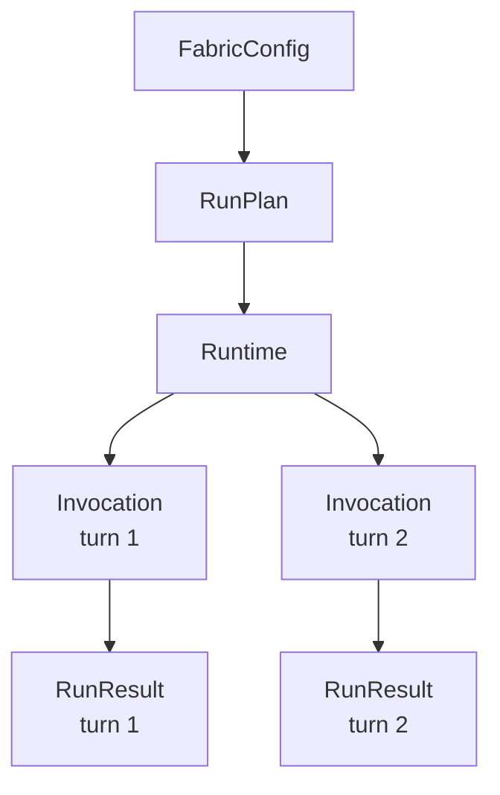

{/* SPDX-FileCopyrightText: Copyright (c) 2026, NVIDIA CORPORATION & AFFILIATES. All rights reserved.
SPDX-License-Identifier: Apache-2.0 */}

The Python SDK is the application-facing interface for NeMo Fabric. Use it to
configure an agent harness, inspect the resolved plan, run one request or a
multi-turn runtime, and collect normalized results, events, artifacts, and
telemetry references.

The SDK is config-first. Applications should construct a Pydantic
`FabricConfig` from their own job, deployment, or evaluation config.
Examples, CI jobs, and applications construct the typed config directly and
can use ordinary Python functions to create variants.

Generated API reference pages remain the source of truth for exact signatures.
This guide explains how the pieces are intended to fit together.

For installation and a package-backed example, start with the
[NeMo Fabric overview](../about-nemo-fabric/overview.mdx).

## Start With One Run

This example uses an NVIDIA-hosted model. Export your NVIDIA API key before
running it:

```bash
export NVIDIA_API_KEY=...
```

Construct a typed config, then pass it to `Fabric.run(...)`. The SDK starts a
runtime, invokes it once, collects the result, and stops the runtime.

```python
import asyncio

from nemo_fabric import (
    Fabric,
    FabricConfig,
    HarnessConfig,
    InstructionConfig,
    InstructionsConfig,
    MetadataConfig,
    ModelConfig,
    RuntimeConfig,
)

config = FabricConfig(
    metadata=MetadataConfig(name="review-agent"),
    harness=HarnessConfig(adapter_id="nvidia.fabric.hermes"),
    instructions=InstructionsConfig(
        system=InstructionConfig(
            content="Review code for concrete correctness risks.",
            mode="replace",
        )
    ),
    runtime=RuntimeConfig(max_turns=8),
    models={
        "default": ModelConfig(
            provider="nvidia",
            model="nvidia/nemotron-3-nano-30b-a3b",
            api_key_env="NVIDIA_API_KEY",
        )
    },
)


async def main() -> None:
    fabric = Fabric()
    result = await fabric.run(
        config,
        input="Review the workspace changes.",
    )

    print(result.status)
    print(result.output.response)


asyncio.run(main())
```

Use `base_dir` to resolve relative paths in an in-memory config. Before running
in a new environment, call `plan(...)` to inspect adapter selection and
`doctor(...)` to check runtime requirements.

The remaining examples reuse this `config` value.

## Execution Model

NeMo Fabric separates configuration, planning, runtime lifecycle, and individual
invocations. It does not expose a separate portable session layer.



Most application code works with four objects:

| Concept | What It Represents | How Consumers Use It |
| --- | --- | --- |
| `FabricConfig` | Typed configuration for the harness, models, runtime, and capabilities. | Construct it from application config before planning or running. |
| `RunPlan` | The canonical config and path context, selected adapter, and declared capabilities. | Inspect it before starting work when adapter selection or feature support matters. |
| `Runtime` | The Python object for one logical, stateful harness execution. | Use it to send ordered invocations and stop the execution. Use it as an async context manager for cleanup. |
| `RunResult` | The normalized outcome of one invocation. | Read its status, output, error, events, artifacts, and correlation IDs. |

`Fabric` is a lightweight, reusable SDK facade. It resolves configuration,
creates plans and runtimes, and provides a single-invocation convenience API,
but it does not represent a started execution and does not require cleanup. A
`Runtime` owns stateful execution and shutdown, so it is the object used as an
async context manager.

`RuntimeHandle` and `InvocationHandle` carry lifecycle identity across the
native boundary. Most Python callers use their `runtime_id` and
`invocation_id` through `Runtime` and `RunResult` rather than manipulating the
handles directly.

A runtime is a logical execution boundary, not necessarily an operating-system
process. An adapter may use an in-process SDK, a process, or shared service
infrastructure while preserving isolated state for each NeMo Fabric runtime.

Runtime hosting is selected by the adapter kind, not by a public `FabricConfig`
setting. Every local Process or Python adapter implements the persistent
local-host wire protocol. NeMo Fabric starts one host during
`start_runtime(...)`, reuses its adapter-owned native resources across ordered
invocations, and attempts to release them during `stop()`. The lifecycle start
operation carries the resolved configuration and capability plan. Each
subsequent `AdapterInvocation` carries only `runtime_context` and `request`.

Third-party local adapters must implement the persistent local-host contract.
NeMo Fabric does not currently define a remote-service adapter contract. A
crashed persistent host is terminal for that runtime. The same applies when the
host exceeds the protocol response timeout. NeMo Fabric does not silently
respawn the host or replay a request.

Harness-native threads, sessions, and conversations remain adapter-owned state
associated with the NeMo Fabric runtime. They are not additional NeMo Fabric lifecycle
objects.

NeMo Fabric provides the runtime contract. Applications own scheduling, queues,
retries, worker scaling, and the number of runtimes to run.

## Configure Agents In Code

### Normalized Configuration Compatibility

NeMo Fabric-owned fields such as workspace, environment variables, and the
invocation deadline apply to every local adapter. Adapter-translated fields are
validated against the selected adapter descriptor during planning.

`Core` means NeMo Fabric owns the behavior and applies it uniformly before or
around adapter execution. `Yes` means the adapter translates the normalized
field into its harness. `No` means an explicitly configured value fails
planning instead of being ignored. The following table groups provider-specific
Relay subfields and additive extension maps because their support does not vary
by adapter:

| `FabricConfig` Field | Claude | Codex | Deep Agents | Hermes Agent |
| --- | --- | --- | --- | --- |
| `schema_version` | Core | Core | Core | Core |
| `metadata.name`, `.description` | Core | Core | Core | Core |
| `harness.adapter_id`, `.resolution` | Core | Core | Core | Core |
| `harness.settings` | Adapter-owned escape hatch | Adapter-owned escape hatch | Adapter-owned escape hatch | Adapter-owned escape hatch |
| `models.<role>.provider` | `anthropic` uses native auth; custom names require an Anthropic Messages-compatible `base_url` and `api_key_env` | `openai` uses native auth; custom names require a Responses-compatible `base_url` and `api_key_env` | Dynamic LangChain provider; custom OpenAI-compatible endpoints require `base_url` and `api_key_env` | Dynamic Hermes provider |
| `models.<role>.model` | Yes | Yes | Yes | Yes |
| `models.<role>.api_key_env` | Yes | Yes | Yes | Yes |
| `models.<role>.base_url` | Yes | Yes | Yes | Yes |
| `models.<role>.temperature` | No | No | Yes | Yes |
| `models.<role>.settings.<key>` | No keys declared | No keys declared | No keys declared | No keys declared |
| `instructions.system` | Yes | Yes; maps to Codex base instructions | Yes | Yes |
| `runtime.input_schema`, `.output_schema` | Core | Core | Core | Core |
| `runtime.artifacts`, `.timeout_seconds` | Core | Core | Core | Core |
| `runtime.max_turns` | Yes | No | No | Yes; maps to Hermes iterations |
| `environment.provider`, `.control_location`, `.ownership` | Core | Core | Core | Core |
| `environment.workspace`, `.artifacts`, `.env` | Core | Core | Core | Core |
| `environment.connection`, `.metadata`, `.settings` | Environment-provider-owned | Environment-provider-owned | Environment-provider-owned | Environment-provider-owned |
| `tools.enabled`, `.blocked` | Yes | No | Yes | Yes; native selectors are Hermes toolset names |
| `skills.paths` | Yes | Yes | Yes | Yes |
| `mcp.servers.<name>.transport`, `.url` with `harness_native` exposure | Yes | Yes | Yes | Yes |
| `mcp.servers.<name>.exposure = "fabric_managed"` | No; not implemented | No; not implemented | No; not implemented | No; not implemented |
| `telemetry.providers.relay` | Yes | Yes | Yes | Yes |
| `telemetry.providers.native` | No | Yes; OpenTelemetry | Yes; OpenTelemetry and OpenInference | No |
| `telemetry.providers.<provider>.config` | Declared-provider pass-through | Declared-provider pass-through | Declared-provider pass-through | Declared-provider pass-through |
| `relay.project`, `.output_dir`, `.observability` | Yes | Yes | Yes | Yes |
| `relay.components`, `.policy` | Yes | Yes | Yes | Yes |
| Additive `extensions` on typed config objects | Preserved; no portable adapter semantics | Preserved; no portable adapter semantics | Preserved; no portable adapter semantics | Preserved; no portable adapter semantics |

Model selection is deterministic: the `default` role wins; otherwise a single
named role is selected. More than one role without `default` fails planning.
Claude and Codex list the provider identifiers that use native authentication
in `adapter_descriptor.config.native_model_providers`. Other lowercase provider
names remain valid when the adapter accepts `models.base_url` and the selected
model supplies both `base_url` and `api_key_env`. Planning and `doctor(...)`
report missing custom-provider connection fields before adapter startup.

If a normalized field has no complete mapping, `plan(...)` and runtime start
fail with a configuration compatibility error naming the adapter and field.
`doctor(...)` retains the incompatibility and returns a failed diagnostic check
so callers can inspect all preflight findings. NeMo Fabric does not silently
drop the field. `runtime.max_turns` is optional, so a config that omits it
remains portable across adapters with different native turn-limit support.

Build the complete nested `FabricConfig` directly, or start with a base
config and use helpers to add capabilities. For example, extend the config from
the first example with skills, MCP, and telemetry:

```python
capability_config = config.model_copy(deep=True)
capability_config.add_skill_path("./skills/code-review")
capability_config.add_mcp_server(
    "github",
    transport="streamable-http",
    url="${GITHUB_MCP_URL}",
    exposure="harness_native",
)
capability_config.enable_relay(
    project="fabric-review",
    output_dir="./artifacts/relay",
)
```

Tool names are adapter-native selectors. NeMo Fabric does not define a portable
catalog that translates names between harnesses. Configure an allowlist, a
blocklist, or both:

```python
from nemo_fabric import ToolsConfig

def with_tool_policy(base):
    tool_config = base.model_copy(deep=True)
    tool_config.tools = ToolsConfig(
        enabled=["Read", "Edit", "Bash"],
        blocked=["WebFetch"],
    )
    return tool_config
```

`tools.enabled=None` preserves the harness default. An empty list disables every
executable tool. A tool cannot appear in both lists. The selected adapter must
enforce the complete configured policy or planning fails. Hermes interprets
these adapter-native selectors as Hermes toolset names.

Config helpers edit the typed config before planning or starting a runtime.
They do not modify already-started runtimes. Use `block_tools(...)`,
`remove_mcp_server(name)`, and `remove_skill_path(path)` to edit a copied config.
Telemetry is enabled by adding entries to `telemetry.providers`; settings
specific to NeMo Relay live in the top-level `relay` block.

For evaluation or deployment variations, use ordinary Python functions and
copies of the typed config. Supply the complete final config to NeMo Fabric.

```python
def review_agent_config(base, *, github_mcp: bool, relay: bool):
    config = base.model_copy(deep=True)
    if github_mcp:
        config.add_mcp_server(
            "github",
            transport="streamable-http",
            url="${GITHUB_MCP_URL}",
            exposure="harness_native",
        )
    if relay:
        config.enable_relay(project="fabric-review", output_dir="./artifacts/relay")
    return config

variant = review_agent_config(config, github_mcp=True, relay=True)
```

NeMo Relay observability is represented directly in the SDK config's top-level
`relay` block. ATOF uses NeMo Relay 0.6 file and stream sinks:

```python
from nemo_fabric import (
    RelayAtofConfig,
    RelayAtofFileSinkConfig,
    RelayAtofStreamSinkConfig,
    RelayObservabilityConfig,
)

relay_config = config.model_copy(deep=True)
relay_config.enable_relay(
    output_dir="./artifacts/relay",
    observability=RelayObservabilityConfig(
        atof=RelayAtofConfig(
            enabled=True,
            sinks=[
                RelayAtofFileSinkConfig(
                    output_directory="./artifacts/relay",
                    filename="events.atof.jsonl",
                    mode="overwrite",
                ),
                RelayAtofStreamSinkConfig(
                    url="http://localhost:4319/events",
                    transport="ndjson",
                ),
            ],
        ),
    ),
)
```

Additional NeMo Relay plugin components can be supplied generically with
`RelayComponentConfig` when their component package is available in the runtime
environment.

The repository's
[code-review example](https://github.com/NVIDIA/NeMo-Fabric/tree/main/examples/code_review_agent)
uses this pattern for complete Hermes Agent, Codex, Deep Agents,
environment, MCP, and telemetry variants.

If a config contains relative paths, pass a `base_dir` to `plan(...)`,
`doctor(...)`, `run(...)`, or `start_runtime(...)`. The base
directory anchors skills, workspaces, artifacts, and other relative paths to
the caller's package or job layout.

## API Inventory

Create `Fabric()` as the primary SDK entrypoint. It is a regular Python object,
not a lifecycle context manager, and may be reused to plan, diagnose, or start
multiple independent runtimes.

The following table summarizes the SDK entry points and runtime methods:

| API | Async | Use When | Notes |
| --- | --- | --- | --- |
| `Fabric.plan(config, base_dir=...)` | No | You need to inspect the selected adapter, capability mapping, and runtime capabilities before running. | Does not start a runtime. |
| `Fabric.doctor(config, *, base_dir=...)` | Yes | You need preflight diagnostics for adapter resolution, capability routing, declared requirements, and environment assumptions. | Checks can inspect local binaries, environment variables, and files without starting a runtime. |
| `Fabric.run(config, base_dir=..., input=...)` | Yes | You need one complete start, invoke, result, stop lifecycle. | `base_dir` is optional. Pass a `RunRequest` instead when the invocation needs IDs, context, or overrides. |
| `Fabric.start_runtime(config, ..., streaming=False)` | Yes | You need state across multiple ordered invocations. | Returns a `Runtime`. Use `streaming=True` with NeMo Relay enabled to provision streaming. |
| `Runtime.invoke(...)` | Yes | You need one turn on an existing runtime. | A runtime permits one active invocation at a time. |
| `Runtime.invoke_stream(...)` | No | You need live ATOF records generated by NeMo Relay for one turn. | Returns an async `InvokeStream`; await `stream.result()` for the terminal `RunResult`. |
| `Runtime.stop()` | Yes | You need to stop or detach from the runtime. | Called automatically when using `async with`. |

## Single-Invocation Runs

Use `run(...)` when the application has one input and does not need to preserve
runtime state after the result is collected.

```python
from nemo_fabric import Fabric, RunRequest

request = RunRequest(
    input="Review the workspace changes.",
    request_id="request-123",
    context={"source": "review-service"},
)

fabric = Fabric()
result = await fabric.run(
    config,
    base_dir="/workspace/review-agent",
    request=request,
)

print(result.status)
print(result.output.response)
print(result.artifacts)
```

Use `input=...` for the common case. Use `request=RunRequest(...)` for structured
invocation metadata. Applications read files themselves and pass either the
loaded input or a validated request to NeMo Fabric.

NeMo Fabric generates runtime and invocation IDs for lifecycle correlation. An
application may include its own identifiers in opaque request metadata, but
NeMo Fabric does not interpret them as job, session, scheduling, or resume state.

## Multi-Turn Runtimes

Use `start_runtime(...)` when the selected harness should keep state across
turns. Every call creates a new logical NeMo Fabric runtime; callers reuse the
returned object rather than selecting it with a job or session ID. The runtime
stops when its async context exits.

```python
from nemo_fabric import Fabric

fabric = Fabric()
async with await fabric.start_runtime(
    config,
    base_dir="/workspace/review-agent",
) as runtime:
    first = await runtime.invoke(input="Inspect the repository")
    second = await runtime.invoke(input="Now review the latest patch")

print(first.status, second.status)
```

The adapter reuses its native state between calls. Codex maps the calls to turns
on one live thread, Deep Agents invokes one compiled graph and checkpointer,
Hermes Agent reuses one agent and session database, and Claude keeps one connected SDK
client. Harness-native identifiers remain adapter-internal.

## NeMo Relay Streaming

Enable NeMo Relay before starting a runtime to consume raw ATOF records while a
turn runs. `Runtime.supports_streaming` reports whether this NeMo Relay path is
available. It is separate from `RuntimeCapabilities.streaming`, which describes
adapter-native progressive output. This separation is intentional:
`Runtime.invoke_stream()` exposes only ATOF records generated by NeMo Relay. A future
normalized NeMo Fabric streaming contract will address adapter-native progressive
output, such as Codex app-server message and item deltas.

The following example streams one invocation and collects its terminal result:

```python
import asyncio

from nemo_fabric import (
    EnvironmentConfig,
    Fabric,
    FabricConfig,
    HarnessConfig,
    MetadataConfig,
    ModelConfig,
)


async def main() -> None:
    config = FabricConfig(
        metadata=MetadataConfig(name="streaming-agent"),
        harness=HarnessConfig(adapter_id="nvidia.fabric.codex"),
        models={
            "default": ModelConfig(provider="openai", model="openai/gpt-5.4")
        },
        environment=EnvironmentConfig(provider="local", workspace="."),
    ).enable_relay()

    async with await Fabric().start_runtime(config, streaming=True) as runtime:
        stream = runtime.invoke_stream(input="Review the latest patch")
        async for record in stream:
            print(record)
        result = await stream.result()
        print(result.status, result.output)


asyncio.run(main())
```

`invoke_stream(...)` is synchronous and starts the invocation in the background.
The returned `InvokeStream` is an async iterator of raw NeMo Relay ATOF
dictionaries. The terminal `RunResult` stays out of band and is available only
through `await stream.result()`. Treat that terminal result as authoritative:
replace any provisional rendering instead of appending it. Calling
`stream.result()` does not finalize unread stream records. Calling
`Runtime.stop()` after the result completes finalizes the stream and discards
those unread records.

Streaming has the following v0.1 constraints:

- Streaming requires two explicit settings: enable NeMo Relay in `FabricConfig`
  and pass `streaming=True` to `start_runtime(...)`. The `streaming=True` flag
  does not enable NeMo Relay by itself; without NeMo Relay telemetry,
  `start_runtime(...)` raises `FabricConfigError`. With both settings, the SDK
  binds its HTTP listener and injects the reserved ATOF stream sink.
- The default `streaming=False` leaves the existing NeMo Relay configuration
  unchanged; it neither enables nor disables ATOF. It also avoids the additional
  listener HTTP and JSON parsing cost for runtimes that use only ATIF,
  OpenTelemetry, OpenInference, or application-configured ATOF sinks.
- One invocation can be active on a runtime. Fully consume the stream or call
  `await stream.aclose()` before starting another turn.
- Breaking an `async for` loop does not finalize the stream. Call
  `await stream.aclose()` explicitly. It waits for the invocation to finish and
  discards unread records; it does not cancel the harness turn.
- The end of async iteration only means that no more ATOF records are available.
  It does not indicate invocation success. Always await `stream.result()`.
  Invocation exceptions raise from that call, while harness-reported failures
  are represented by the returned result's status and error fields.
- The SDK limits its queue to 1,024 records and 16 MiB of encoded record data.
  It rejects individual records larger than 1 MiB and applies TCP backpressure.
  NeMo Relay can drop records if a consumer stalls longer than its delivery
  timeout.
- ATOF granularity depends on the NeMo Relay integration. Gateway harnesses expose
  per-delta event structure, but current ATOF records keep token text in the
  terminal scope. In-process harnesses expose scope-level progress.
- Reconstruct nested and parallel work with `uuid` and `parent_uuid`. Stream
  order alone does not define the Deep Agents scope tree.
- The listener correlates records to one NeMo Relay scope tree. Deep Agents and
  Hermes roots carry the NeMo Fabric request ID. For Claude and Codex, the SDK
  matches NeMo Relay turn scopes by their role and 1-based turn index. Records
  outside the matched root and its descendants are discarded, so delayed
  records from another turn do not enter the active stream. If the gateway
  turn sequence does not align with the NeMo Fabric invocation sequence, the SDK
  yields no uncorrelated records and emits a `RuntimeWarning` after natural
  stream exhaustion. A short drain window only collects late records from the
  matched tree; it does not define turn ownership.
- The SDK listener binds to the address in `NEMO_FABRIC_STREAMING_HOST`, which
  defaults to `127.0.0.1`. Override it when a Claude or Codex gateway must reach
  the SDK through another network interface. Because the listener accepts ATOF
  HTTP posts, restrict access to the configured interface. If async iteration
  reaches the post-turn drain timeout without a NeMo Relay connection, or if
  NeMo Relay sends data but no record matches the active turn, the SDK emits
  one `RuntimeWarning` for that failure mode. It also warns if a NeMo Relay
  upload terminates before completing its chunked request body because the
  yielded stream can be incomplete. A caller that only awaits
  `stream.result()` still receives the terminal result and does not run this
  warning check.

Claude and Codex streaming use the NeMo Relay `nemo-relay` gateway CLI and require a
stream-sink-capable release from `0.6.0` up to, but not including, `0.7.0`. Follow
the [NeMo Relay CLI installation instructions](../getting-started/install.mdx#nemo-relay-cli)
to provision it. Hermes Agent and Deep Agents use their in-process NeMo Relay
integrations.

## Application-Owned Parallelism

Applications create independent runtimes when they want parallel work. NeMo Fabric
does not own a queue, worker pool, semaphore, retry policy, timeout policy, or
numeric concurrency limit. Each `Runtime` accepts one invocation at a time so
its ordered harness state cannot be changed by two calls at once. If an
application overlaps calls on the same `Runtime`, the second call raises
`FabricStateError`. To perform work in parallel, start independent runtimes;
the application decides how many to run.

Async lifecycle calls run blocking native work outside the Python event loop,
so independent runtimes can make progress concurrently. This does not add a
NeMo Fabric concurrency limit or scheduler.

```python
import asyncio


async def review_one(prompt: str):
    return await Fabric().run(config, input=prompt)


async def main() -> None:
    results = await asyncio.gather(
        review_one("Review patch A"),
        review_one("Review patch B"),
    )
    print([result.status for result in results])


asyncio.run(main())
```

For example, each Harbor job starts an independent NeMo Fabric runtime. Harbor owns
job IDs and concurrency policy; NeMo Fabric does not use a job ID to select or
resume runtime state.

## Unified Run Results

Every invocation that reaches the adapter boundary returns a normalized
`RunResult`, even when the harness invocation itself failed. Inspect `status`,
`error`, `events`, and `artifacts` first, then process `output` when the status
is successful.

Important fields:

| Field | Meaning |
| --- | --- |
| `status` | Terminal invocation status such as success, failure, or cancellation. |
| `output` | Harness output normalized to the configured output schema. |
| `error` | Structured failure metadata when available. |
| `artifacts` | Output files, logs, patches, native artifacts, and other materialized references. |
| `telemetry` | References to NeMo Relay or other telemetry streams produced by the run. |
| `events` | Ordered normalized lifecycle and invocation events. |
| `metadata` | Result-specific structured metadata. |
| `runtime_id`, `invocation_id`, `request_id` | IDs for correlation across runtimes, logs, telemetry, and artifacts. |

These are structured correlation fields, not interchangeable metadata:
`runtime_id` identifies the runtime lifecycle, `invocation_id` identifies one
invocation within that runtime, and `request_id` correlates the caller's
request. NeMo Fabric-generated values use type-specific prefixes such as `runtime-`,
`invocation-`, and `request-`; callers may provide their own `request_id`.
Consumers should store and log each field separately and otherwise treat its
value as opaque rather than parsing the identifier encoding.

If NeMo Fabric cannot resolve config, start a runtime, or obtain a normalized result,
the SDK raises a `FabricError` subclass instead of returning a partial
`RunResult`.

## Events

Each `RunResult` includes the normalized events collected for that invocation.
Event kinds and detail may vary by adapter, but their lifecycle and correlation
fields use the common NeMo Fabric contract.

Events are useful for:

- rendering invocation history in application or service UIs;
- forwarding logs and status to evaluation harnesses;
- correlating runtime, invocation, adapter, and telemetry IDs;
- reporting structured failures alongside the terminal result.

## Feature Support Across Harness Adapters

The SDK presents one consistent shape across adapters, but adapters differ in
their runtime requirements, accepted configuration, and optional capabilities.

Use `plan(...)` and `doctor(...)` before relying on optional features:

```python
fabric = Fabric()
plan = fabric.plan(config)
report = await fabric.doctor(config)

print(plan.adapter.adapter_id)
print(report.status)
```

Use the plan to confirm adapter selection and capability routing. Use the doctor
report to catch unresolved adapter descriptors, unsupported normalized
capabilities, missing declared requirements, and environment problems before
starting a runtime.

Capability routes assign execution ownership; they do not describe network
routing. `harness_native` means the selected adapter executes the capability
through its harness. `fabric_managed` means NeMo Fabric executes it outside the
harness-native surface. `unsupported` means neither side can execute it.
Routes apply to tools, skills, and MCP servers. Scalar fields such as
`instructions.system` and `runtime.max_turns` are validated separately against
the adapter descriptor.

## Install And Runtime Responsibilities

In production, the consumer or execution environment is responsible for
installing NeMo Fabric, the selected harness, adapter dependencies, model access,
credentials, and any required native tools. NeMo Fabric validates and diagnoses the
runtime assumptions, but it does not silently install harnesses or credentials at
invocation time.

Development environments may use extras, virtual environments, or local source
checkouts to make iteration easy. Production environments should prefer explicit
images, preinstalled dependencies, or managed deployment packages.

Runtime compatibility checks should validate:

- NeMo Fabric SDK and native extension versions;
- selected adapter version;
- selected harness version or version range;
- required environment variables or secret references;
- optional capability support such as NeMo Relay, MCP, or tool exposure.

## Custom Fields And Adapter Settings

Use normalized NeMo Fabric fields for portable behavior: models, system
instructions, turn limit, runtime, environment, skills, MCP, telemetry, tools,
and artifacts.

Supply request context through `RunRequest.context` for each invocation. Request
context is not part of `FabricConfig`.

Use `harness.settings` only for stable, harness-native behavior that the selected
adapter understands, such as Claude permission policy, Codex sandbox controls,
or Deep Agents subagent definitions. Executable paths, Relay command discovery,
state directories, and similar launch mechanics are runtime implementation
details rather than public adapter settings.

Use `FabricConfig.metadata` for human-readable agent identity and caller-owned
annotations. NeMo Fabric preserves these values in the resolved configuration
but does not copy them into `RunResult.metadata`. Use `request_id` and
`RunRequest.context` for per-invocation correlation. `RunResult.metadata`
contains adapter-specific result details.

Adapter settings are not portable by default. An adapter must explicitly read
and implement a setting before it affects runtime behavior. Planning and doctor
fail for normalized fields the selected adapter does not support. Validation of
all adapter-specific `harness.settings` keys remains adapter-owned.

## Errors

All public SDK errors inherit from `FabricError`.

| Error | Meaning |
| --- | --- |
| `FabricConfigError` | Invalid config, request, or override. |
| `FabricCapabilityError` | Selected adapter does not support the requested operation. |
| `FabricRuntimeError` | Runtime startup, invocation, or shutdown failed before a normalized result could be returned. |
| `FabricStateError` | Invalid runtime state transition, such as invoking after stop or starting overlapping invocations. |
| `FabricNativeUnavailableError` | Native extension is not installed or importable. |

Consumers own job-level retries and rollout-level failure policy.
Single-invocation runs attempt to stop the runtime before returning. A `Runtime`
used with `async with` also attempts cleanup after an invocation error; if cleanup
fails, that failure is attached to the original exception rather than replacing
it. NeMo Fabric records structured error metadata when possible and returns enough
detail for the consumer to decide what to do next.

## SDK Contract Boundaries

NeMo Fabric keeps a narrow execution contract. Applications own product behavior
around that contract.

### Schemas And Python Models

The SDK's Pydantic models are maintained against the Rust-generated public
schemas. The schemas describe the typed cross-language contracts. Use the
generated API reference for exact Python signatures.

| Contract | Source |
| --- | --- |
| SDK Pydantic models | `nemo_fabric.models`; refer to the generated [Models reference](../reference/api/python-library-reference/nemo_fabric.models.md) |
| Agent config | `schemas/agent.schema.json` |
| Run plan | `schemas/run-plan.schema.json` |
| Request, result, and events | `schemas/run-request.schema.json`, `schemas/run-result.schema.json`, `schemas/fabric-event.schema.json` |
| Runtime and invocation handles | `schemas/runtime-handle.schema.json`, `schemas/invocation-handle.schema.json` |
| Artifacts and errors | `schemas/artifact-manifest.schema.json`, `schemas/error-info.schema.json` |

### Versioning

NeMo Fabric uses explicit contract versions where persisted or independently
maintained artifacts cross package boundaries:

- `schema_version` identifies the typed NeMo Fabric config contract transported
  across SDK and language boundaries.
- `contract_version` identifies the adapter descriptor contract implemented by
  a `fabric-adapter.json` file.
- Python and Rust package versions identify the installed SDK/core release.

NeMo Fabric versions top-level typed contracts and independently maintained adapter
metadata. It does not version each config subsection independently. For
example, MCP, skills, models, telemetry, and runtime fields evolve under the
enclosing `schema_version`.

NeMo Fabric validates adapter descriptor contract versions during planning. Package
semver identifies the installed implementation, but it is not the compatibility
contract for independently maintained adapters.

### Config Extensibility

The public schema has typed fields for stable NeMo Fabric concepts and controlled
extension points for adapter- or application-owned data. Use known fields for
portable concepts such as harness selection, models, runtime, skills, MCP,
telemetry, and artifacts. Use adapter-owned `harness.settings`, metadata, or
preserved extension fields for data NeMo Fabric should carry but not interpret.

Additive optional fields may be introduced within the existing document schema
version when old configs remain valid. Required fields, removed fields, or
semantic changes that alter how existing configs are interpreted require a new
enclosing document schema version or an explicit compatibility path.

Unknown data is not the same as supported behavior. An adapter must advertise
and implement a capability before NeMo Fabric treats it as runnable.

### Resilience

NeMo Fabric reports lifecycle failures; applications own recovery policy. If a
runtime process dies, a connection is permanently lost, or an adapter cannot
complete an invocation, NeMo Fabric marks the relevant runtime/invocation as
failed and returns structured error metadata when possible.

Transient I/O failures may be marked with retryable error metadata, but NeMo Fabric
does not perform job-level retries by default. Consumers decide whether to retry
the request, start a replacement runtime, fail the job, or escalate to a user.

### Capacity And Backpressure

If a harness reports capacity pressure, an adapter should surface it as a
structured error or event such as busy, rate limited, capacity exceeded, or
backpressure. The consumer decides whether to wait, retry, scale out, or fail.

## Next Steps
- Review the examples in the GitHub repo [`examples/`](https://github.com/NVIDIA/NeMo-Fabric/tree/main/examples).
